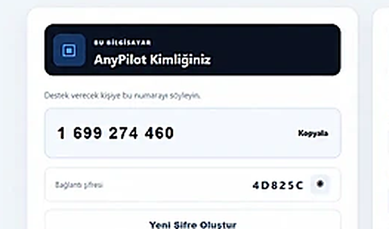
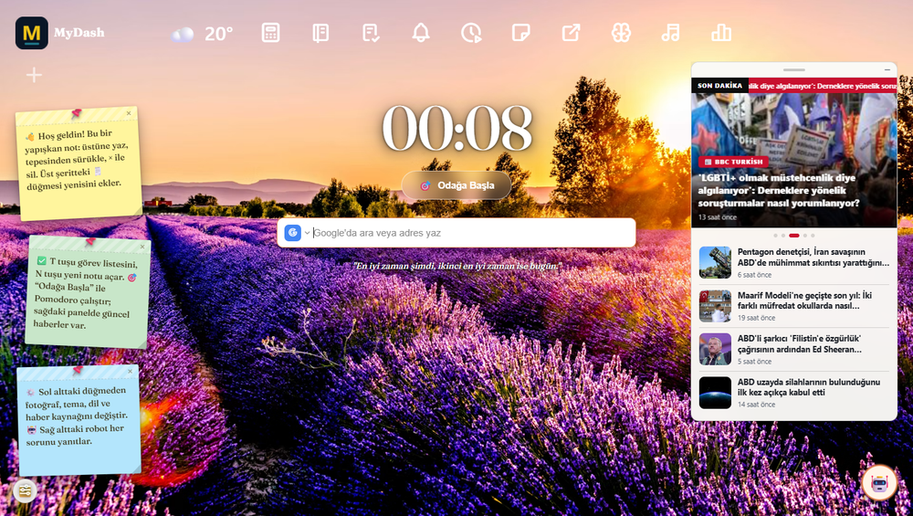
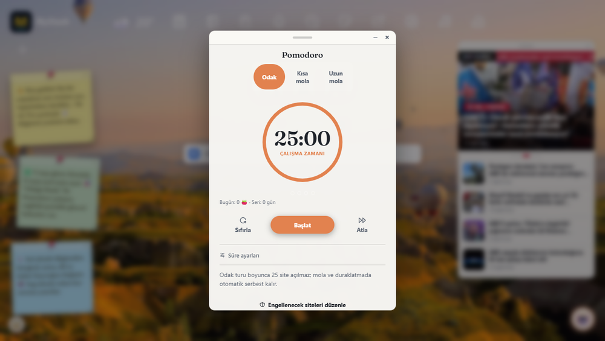
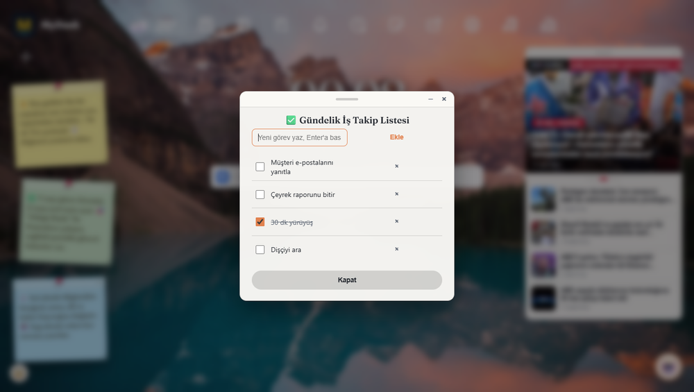

# Gelişim Otomasyon & Yazılım — Ürünler

İki ürün geliştiriyoruz: uzaktaki bilgisayarlara güvenle bağlanmak için **AnyPilot**,
Chrome'un boş yeni sekmesini çalışma panosuna çevirmek için **MyDash**.

🌐 **[anypilot.gelisimapps.com](https://anypilot.gelisimapps.com)** · ✉️ iletisim@gelisimapps.com

---

## AnyPilot — Uzak masaüstü ve uzaktan destek

Uzaktaki bilgisayara ulaşmak için yola çıkmanıza gerek yok. Tek dosya kurulum,
9 haneli kimlik ve tek kullanımlık şifre ile bağlanın.

- Uçtan uca şifreli bağlantı
- Onay vermeden oturum başlamaz
- Ekran paylaşımı, dosya aktarımı, merkezi cihaz yönetimi
- Kendi sunucunuzda, kendi markanızla (white-label)
- Windows, macOS ve Linux

📄 **[Ürün sayfası](https://anypilot.gelisimapps.com)** · 💼 **[Paketler ve fiyatlar](https://anypilot.gelisimapps.com/paketler.html)** · 🇬🇧 **[English](https://anypilot.gelisimapps.com/anypilot-en.html)**

---

## MyDash — Chrome yeni sekme panosu

Her yeni sekmeyi sakin ve odaklı bir çalışma alanına çevirir: görevler, notlar,
Pomodoro sayacı, hava durumu, haberler ve hızlı bağlantılar tek ekranda.

- Görevler, notlar ve yapışkan notlar
- Pomodoro odak sayacı, günlük seri takibi
- Hava durumu, haber akışı, hızlı bağlantılar
- Google ve Outlook takvimi (Pro)
- 6 dil: Türkçe, İngilizce, İspanyolca, Fransızca, Almanca, Portekizce
- Verileriniz tarayıcınızda kalır — hesap gerekmez

| Pomodoro | Görevler |
|---|---|
|  |  |

🧩 **[Chrome Web Mağazası'ndan ücretsiz kur](https://chromewebstore.google.com/detail/hgdbmdemlcgeoffoijamkiejehecianj)** · 📄 **[Ürün sayfası](https://anypilot.gelisimapps.com/mydash.html)** · 🇬🇧 **[English](https://anypilot.gelisimapps.com/mydash-en.html)**

---

## In English

**AnyPilot** is self-hosted remote desktop and remote support software: end-to-end
encrypted sessions, file transfer and central device management, running on your own
server with your own branding. → [anypilot.gelisimapps.com/anypilot-en.html](https://anypilot.gelisimapps.com/anypilot-en.html)

**MyDash** turns Chrome's new tab into a calm dashboard — tasks, notes, a Pomodoro
timer, weather, news and quick links, all in one place. Free on the Chrome Web Store,
available in 6 languages. → [anypilot.gelisimapps.com/mydash-en.html](https://anypilot.gelisimapps.com/mydash-en.html)

---

## Videolar

- 🎬 [AnyPilot tanıtım filmi (TR)](https://youtu.be/UAWCqC7AMHs) · [EN](https://youtu.be/49N-qSP7xZk)
- 🎬 [MyDash tanıtım filmi (TR)](https://youtu.be/WhnxOOi2gSY) · [EN](https://youtu.be/Oy6GCYYVz_U)
- 📺 [YouTube kanalımız](https://www.youtube.com/@Anypilotgelisimapps)

## İletişim

Kurumsal kullanım, toplu lisans ve iş birlikleri için: **iletisim@gelisimapps.com**

Gelişim Otomasyon & Yazılım · [gelisimotomasyon.com](https://www.gelisimotomasyon.com)

---

*Bu depo ürün tanıtımı içindir; kaynak kod barındırmaz.*
